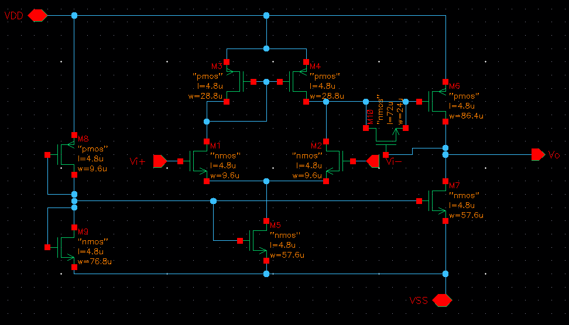
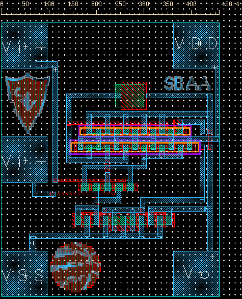
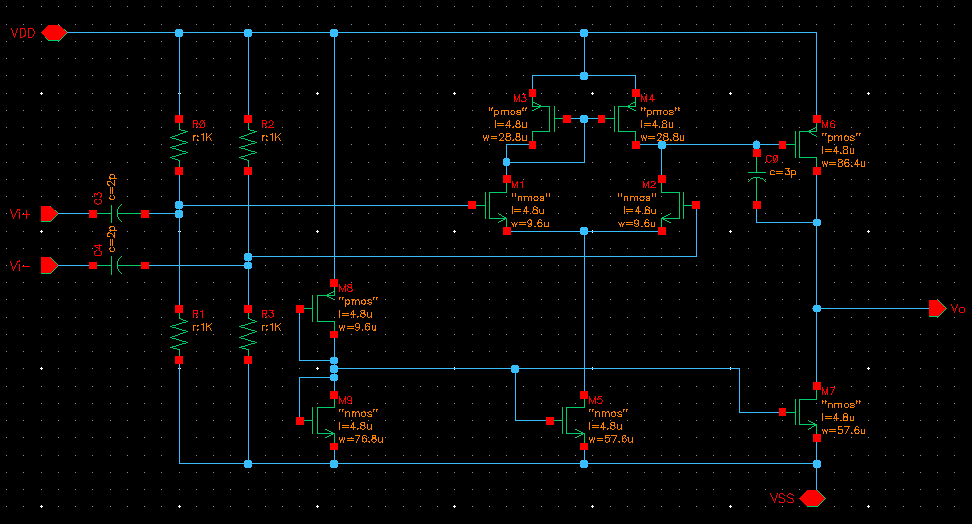
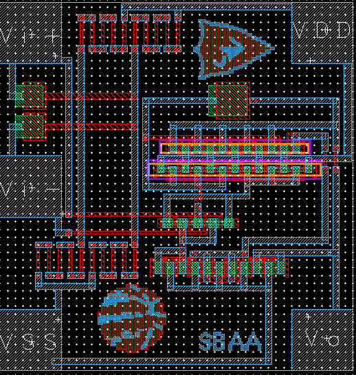
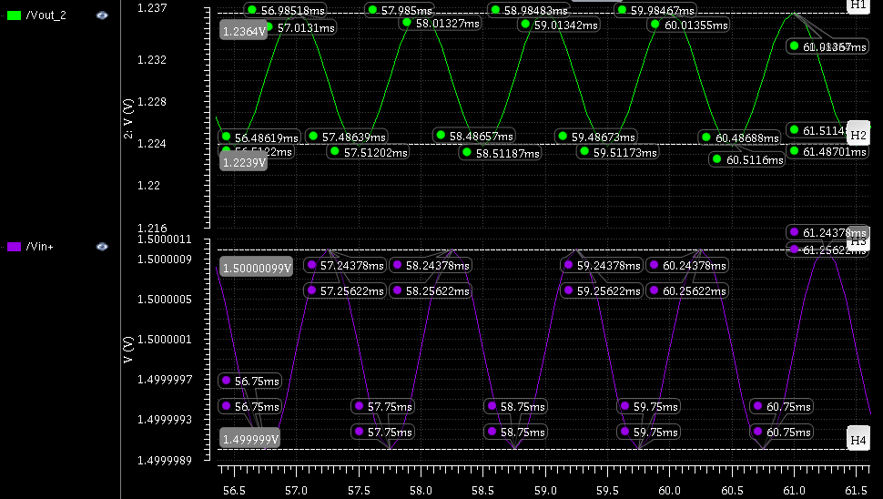

# IC-Design-Project
IC design project of an Operational Amplifier. This repository includes the schematic and layout of the analog design. Op-Amp has a gain of 900 V/V. This project includes two models, one with an input bias stage and one without. Both have been fabricated at Carelton University's Fabrication Labratory. 
Designed using 5um technology in Cadence Virtuoso. 

The included files are the images of the two layouts and schematics. The Bode, Phase and Gain plots are included.

## Op-Amp with No Input Biasing

## Op-Amp with No Input Biasing

## Output

